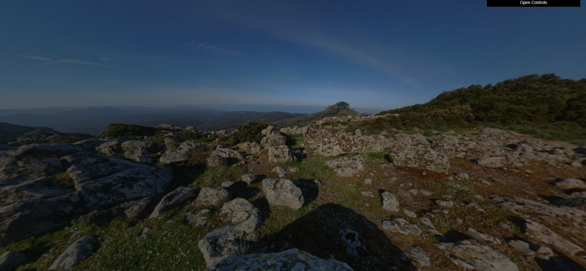
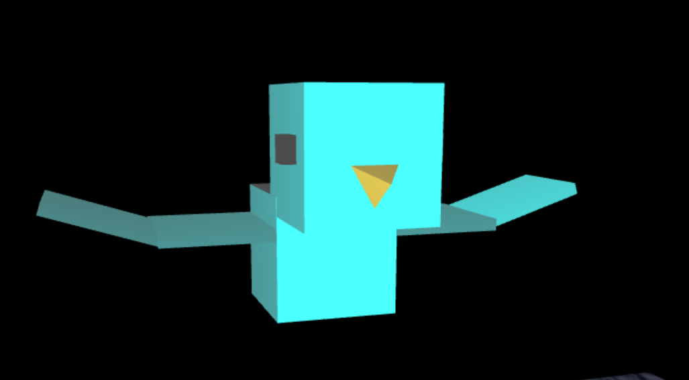
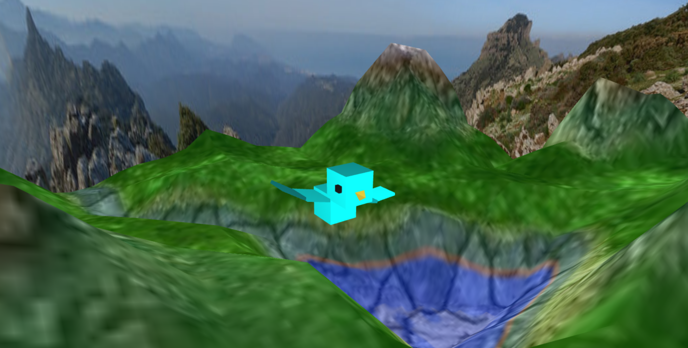
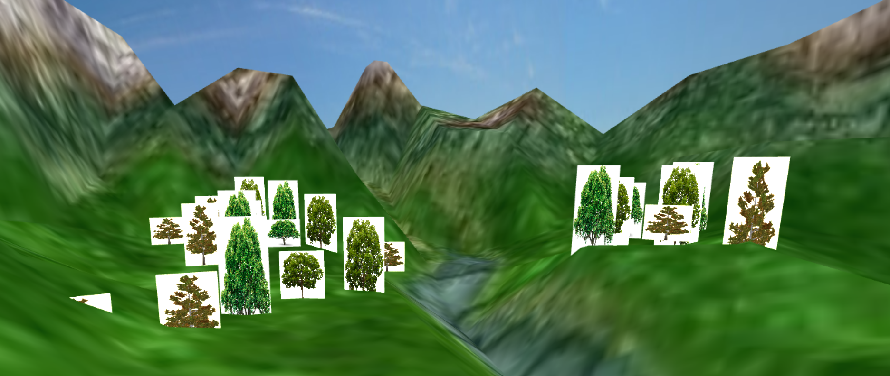

# CG 2022/2023

## Group T010G08

## Project Notes

- Our group successfully parameterized the MySphere class to invert its faces, making it visible from the inside. This allowed for the use of a small sphere with a panoramic image to create a landscape where the observer can move within. The implementation considers the order of vertices and normals for accurate rendering. Overall, our work enables the creation of immersive panoramic environments.

- In accordance with the project requirements, our group successfully implemented the MyBird class to model a bird within the scene. The bird consists of a body, head (with eyes and beak), and wings. We utilized a combination of previously used objects, such as cubes, pyramid, and quads, to create the bird's geometry.
- Also, our group successfully implemented the necessary animation and control mechanisms for the MyBird class. The bird was positioned 3 units above the ground and featured two animations: slight oscillation and wing flapping. Control mechanisms were added to enable movement and rotation of the bird using specific keys. Sliders were included in the GUI to adjust the speed factor and scale of the bird.

- Our group then successfully implemented altimetry on the terrain by creating the MyTerrain class. It utilizes a height map texture to represent elevations. The shader was modified to incorporate a color gradient texture, allowing for a visual representation of altimetry. Screenshots were captured to showcase the terrain, bird, and background.

- We added a new class called MyBillboard, which includes an instance of MyQuad. The display function of MyBillboard was modified to rotate the quad so that it always faces the camera. Additionally, transparency was implemented using a provided texture (billboardtree.png) or a custom one, and fragments with less than full opacity were discarded in the fragment shader. Furthermore, we created two classes: MyTreeGroupPatch and MyTreeRowPatch. MyTreeGroupPatch represents a set of 9 trees arranged in a 3x3 grid with slight variation in dimensions and textures. MyTreeRowPatch represents a row of 6 trees with slight misalignment. Each tree is assigned a random texture from a set of 3 options. The trees texture were made by our fellow course student Manuel Rodrigues.

