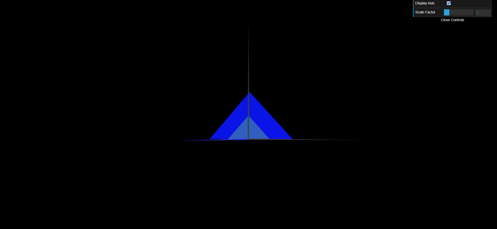

# CG 2022/2023

## Group T010G08

## TP 1 Notes

- In exercise 1, we learned the basics of computer graphics by using the vertices of triangles to create various shapes and place them in 3D space, as well as incorporating some GUI features.
- In exercise 2, we learned about changing the size of objects and how they can overlap. In the following screenshot, the group changed the z coordinates slightly on the big triangle so that both triangles could be seen simultaneously in the screenshot.

