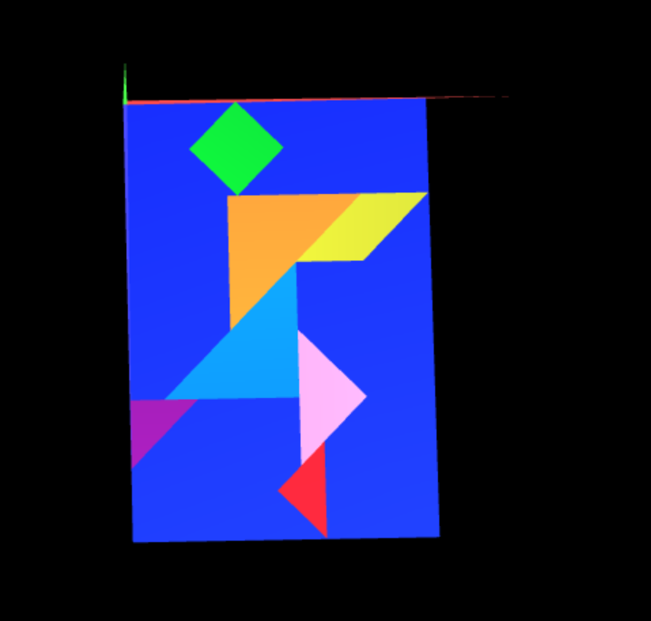

# CG 2022/2023

## Group T010G08

## TP 2 Notes

- In exercise 1, we were able to pratice the 3 basic operations of computer graphics. We also went one step further and decided to add colors to the Tangram and also a second light source, so the colors could be visualized better.

- In exercise 2, we created a cube, from which we can manipulate it so that it serves as the surface of the tangram previously built.

- In exercise 3, we created a new class called MyQuad, in which we use the initBuffers() method to sets the vertices and indices of the square, after that, we also created a another class called MyUnitCubeSquad. It contains six instances of MyQuad, one for each face of the cube. we use the methods pushMatrix(), rotate(), translate(), display(), popMatrix() to perform the geometric transformations on this cube to be well positioned below the tangram.
