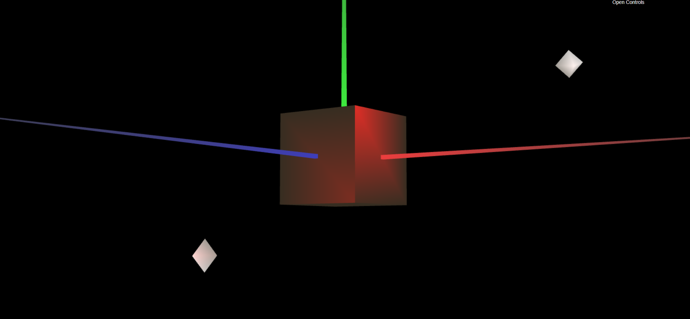
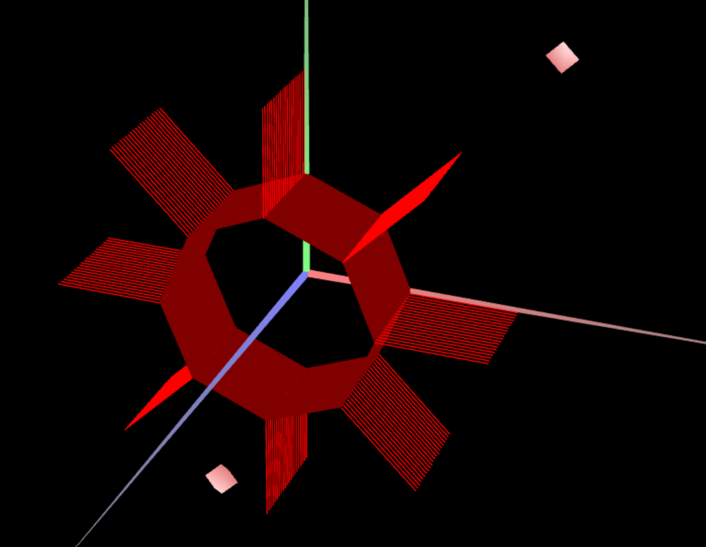
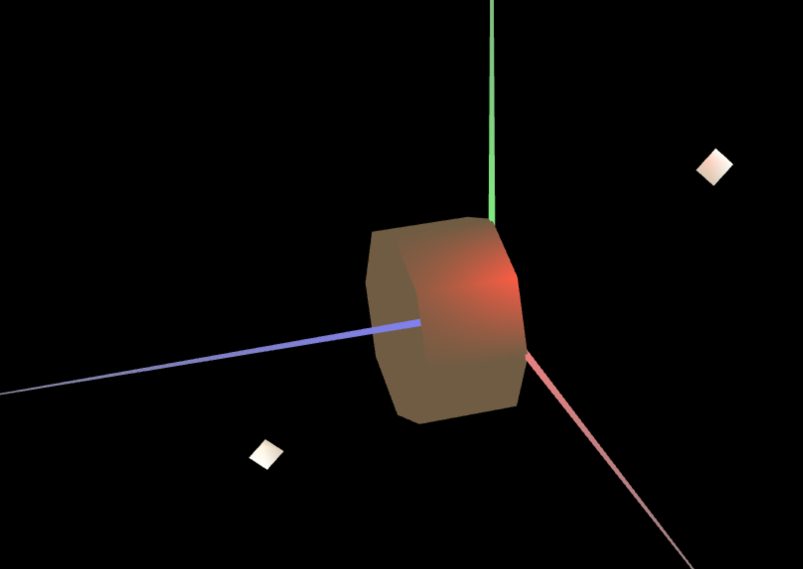

# CG 2022/2023

## Group T010G08

## TP 3 Notes

- In this exercise, we learned how to define normals for proper lighting. We also learned how to create custom materials with different specular components and colors, and apply them to specific objects in the scene. Additionally, we explored textures and learned how to load and apply them to objects, adding more visual complexity and realism to our scene. 

- In exercise 2, we learned how to define normals that will be similar to that calculated with "Constant Shading". This is because lighting is calculated based on the orientation of normals in relation to the direction of the light source. In the case of having only one floor in the prism, the orientation of normals in relation to the light will be the same throughout the surface of the prism, resulting in uniform lighting, that is, similar to the lighting calculated with "Constant Shading". However, if the prism has more floors or if there are other shapes in the scene, the correct definition of normals will be essential to obtain realistic lighting.

- In exercise 3, we learned the importance of defining the normal of each vertex to be perpendicular to the surface of the perfect cylinder in which the original prism is inscribed. This means that each vertex that is used in two adjacent sides will always have the same normal. in this class is a specific implementation of this technique for creating cylindrical surfaces, where the normals of each vertex are carefully defined to ensure accurate lighting. The Gouraud shading technique helps to create the illusion of something smoother, polished, and more realistic in 3D objects.
