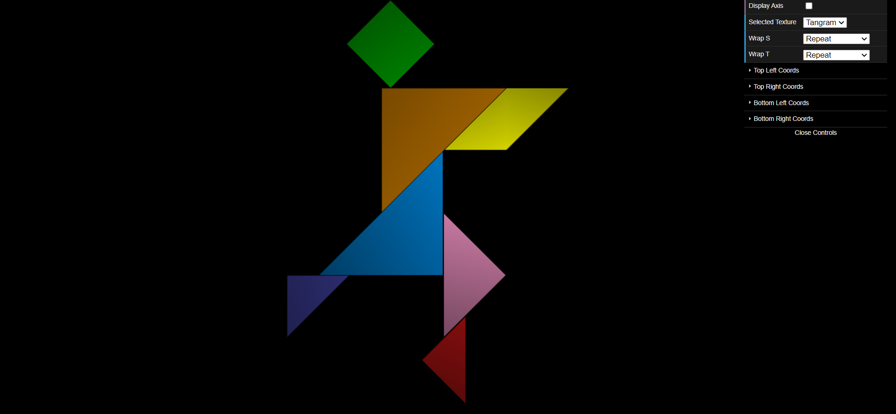
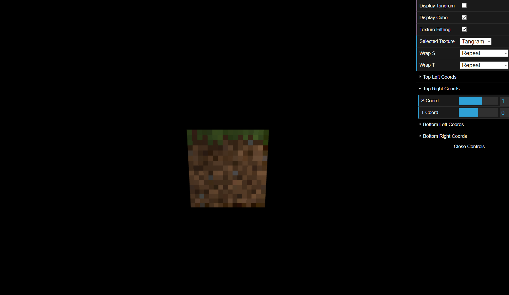

# CG 2022/2023

## Group T010G08

## TP 4 Notes

- We learned how to apply a texture to a WebGL scene using texture coordinates. By mapping each Tangram piece to its representation in the tangram.png file, we can create a more realistic 3D representation of the puzzle.

- In exercise 2, we learned how to apply different textures on the same object, but on different planes of that object, which in this case was a cube with textures of a Minecraft block. Additionally, we applied a filter so that the textures can become more visible and beautiful.
