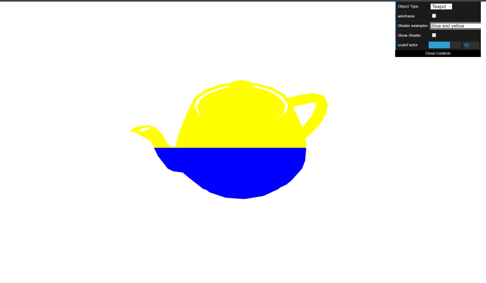
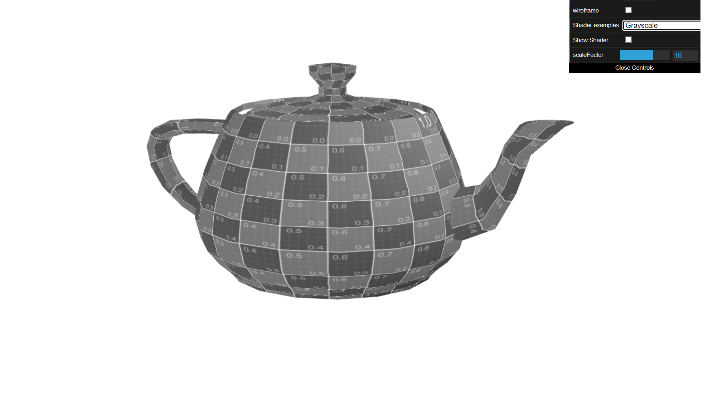
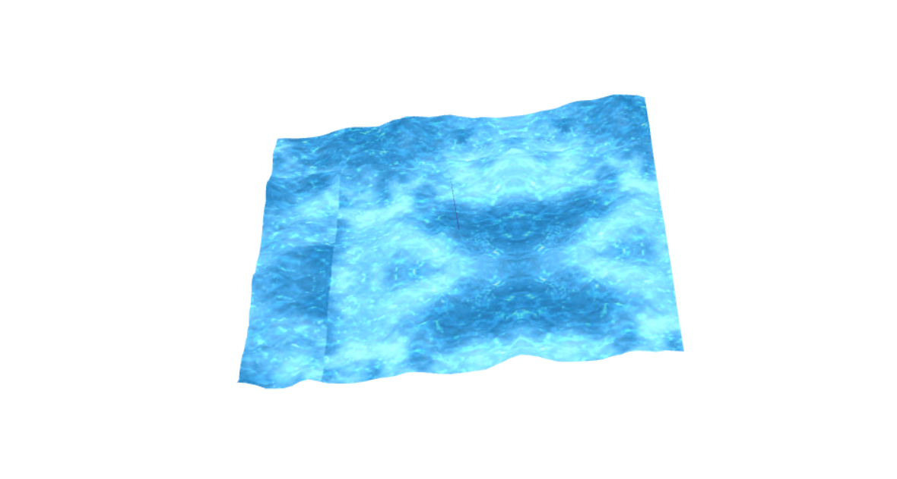

# CG 2022/2023

## Group T010G08

## TP 5 Notes

- We learned how to create and modify shaders in WebGL. Specifically, how to create a vertex shader and a fragment shader, and how to pass data between them using varying variables. We also learned how to apply mathematical operations in shaders to create effects such as animation and color manipulation. Finally, how to convert all the components RGB to specific color.

- We learned how to animate an object using multiple shaders and textures :)

